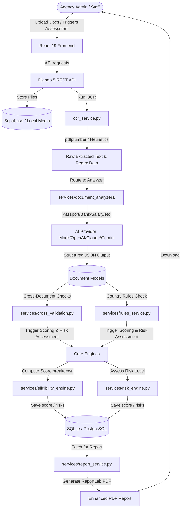

# VisaFlow AI — System Architecture & Implementation Guide

VisaFlow AI is a production-ready AI Visa Eligibility Assessment Platform. It automates the parsing, verification, and eligibility scoring of applicant documents against country-specific visa rules.

---

## 1. System Architecture

Below is the high-level architecture diagram showing the flow of document uploads, OCR extraction, AI analyzers, the Rules/Scoring engines, and report generation.



---

## 2. Document Pipeline & AI Providers

The system handles 10 document categories:
1. **Passport** (`passport`)
2. **Bank Statement** (`bank_statement`)
3. **Salary Slip** (`salary_slip`)
4. **Employment Letter** (`employment_letter`)
5. **Tax Return / ITR** (`tax_return`)
6. **Travel History** (`travel_history`)
7. **Invitation Letter** (`invitation_letter`)
8. **Hotel Booking** (`hotel_booking`)
9. **Flight Booking** (`flight_booking`)
10. **Cover Letter** (`cover_letter`)

### AI Provider Interface
The platform abstracts AI services behind a unified `AIProvider` base class (in [ai_provider.py](file:///d:/projects/Live%20Projects/visa-validation-system/backend/services/ai_provider.py)):
- **Mock AI Provider**: Default option. Requires no API keys. Generates highly realistic assessments, anomalies, and recommendations based on filenames and mock rules.
- **OpenAI Provider**: Uses GPT-4o-mini to analyze documents.
- **Claude Provider**: Uses Claude-3-Haiku.
- **Gemini Provider**: Uses Gemini-2.5-Flash.

---

## 3. Database Schema

Here is the database layout highlighting modified and new tables.

### Modified Tables

#### `submissions_document` (Document Model)
Stores references to uploaded documents, raw text, and structured AI extractions.
- `category` (VARCHAR, choices): The document category slug.
- `raw_text` (TEXT): Full raw text extracted via OCR.
- `confidence_score` (FLOAT): Confidence score (0.0–1.0) of the extraction.
- `extracted_data` (JSON): Simple parsed fields extracted via regex.
- `ai_analysis` (JSON): Detailed AI analysis including entity extraction, anomalies, flags.

#### `submissions_submission` (Submission Model)
Ties together all elements of a single visa application.
- `application_id` (VARCHAR, unique): Human-readable reference (e.g., `APP-A3K9X`).
- `processing_status` (VARCHAR, choices): `pending`, `processing`, `completed`, `failed`.
- `processing_logs` (JSON): Chronological timeline of AI and validation events.

### New Tables

#### `eligibility_eligibilityscore` (EligibilityScore Model)
Created automatically when running the AI assessment pipeline.
- `submission_id` (UUID, OneToOne): Key linking to the submission.
- `financial_score` (INTEGER): Financial strength rating (0–100).
- `employment_score` (INTEGER): Job/tenure stability rating (0–100).
- `travel_history_score` (INTEGER): International travel rating (0–100).
- `documentation_score` (INTEGER): OCR readability and documentation completeness rating (0–100).
- `compliance_score` (INTEGER): Compliance with specific destination rules (0–100).
- `final_score` (INTEGER): Weighted sum of all 5 scores.
- `weighted_breakdown` (JSON): Weight and contribution metrics.
- `risk_level` (VARCHAR): `LOW`, `MEDIUM`, or `HIGH` risk profile.
- `risk_factors` (JSON): Details on detected issues and risk severities.
- `cross_validation_results` (JSON): Discrepancy checks across documents.
- `recommendations` (JSON): Order-ranked suggestions to improve eligibility.
- `strengths` (JSON): Positive highlights of the profile.
- `is_eligible` (BOOLEAN): True if final score >= 70 and no `HIGH` risk factors.
- `eligibility_summary` (TEXT): AI summary text.

---

## 4. API Endpoints

All new and updated API endpoints:

| Method | Endpoint | Description |
|---|---|---|
| `POST` | `/api/submissions/{id}/ai_assess/` | Trigger full AI assessment (OCR + AI analysis + scoring + risks). |
| `GET` | `/api/submissions/{id}/processing_logs/` | Retrieve execution logs/timeline for the AI pipeline. |
| `GET` | `/api/submissions/{id}/download_report/` | Download the enhanced ReportLab PDF report containing AI scoring and metrics. |
| `GET` | `/api/eligibility/by-submission/{id}/` | Get the computed eligibility scores and risk factors. |
| `GET` | `/api/dashboard/analytics/` | View system analytics (now includes AI assessment counts and risk breakdown). |

---

## 5. Deployment & Configuration

### Environment Variables (.env)
Set these variables in your `.env` file at the project root:

```ini
# AI Provider options: 'mock' | 'openai' | 'claude' | 'gemini'
AI_PROVIDER=mock

# OpenAI Settings (optional)
OPENAI_API_KEY=your-openai-api-key
OPENAI_MODEL=gpt-4o-mini

# Claude Settings (optional)
ANTHROPIC_API_KEY=your-claude-api-key
ANTHROPIC_MODEL=claude-3-haiku-20240307

# Gemini Settings (optional)
GOOGLE_AI_API_KEY=your-gemini-api-key
GOOGLE_AI_MODEL=gemini-2.5-flash

# Celery (defaults to sync Eager execution. For Redis async queue, set Celery Eager to False)
CELERY_TASK_ALWAYS_EAGER=True
CELERY_BROKER_URL=redis://localhost:6379/0
```

### Installation & Run

#### Backend Setup
1. Install Python packages:
   ```bash
   pip install -r backend/requirements.txt
   ```
2. Apply database migrations:
   ```bash
   python backend/manage.py migrate
   ```
3. Start the Django dev server:
   ```bash
   python backend/manage.py runserver
   ```

#### Frontend Setup
1. Install node packages:
   ```bash
   pnpm install
   ```
2. Run Vite dev server:
   ```bash
   pnpm dev
   ```
